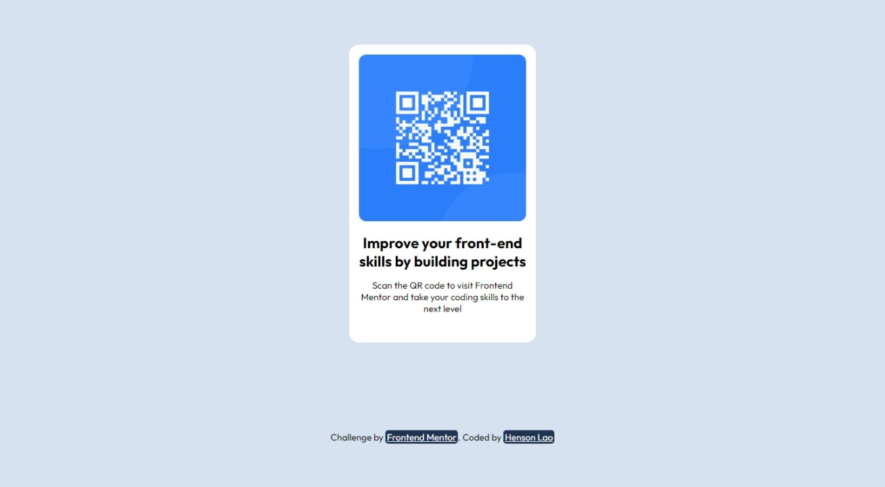

# Frontend Mentor - QR code component solution

This is a solution to the [QR code component challenge on Frontend Mentor](https://www.frontendmentor.io/challenges/qr-code-component-iux_sIO_H). Frontend Mentor challenges help you improve your coding skills by building realistic projects.

## Table of contents

- [Overview](#overview)
  - [Screenshot](#screenshot)
  - [Links](#links)
- [My process](#my-process)
  - [Built with](#built-with)
  - [What I learned](#what-i-learned)
  - [Useful resources](#useful-resources)
- [Author](#author)
- [Acknowledgments](#acknowledgments)

## Overview

### Screenshot



### Links

- Solution URL: [Solution](https://github.com/hnsnl15/qr-code-component-main-solution)
- Live Site URL: [Live Site](https://hnsnl15.github.io/qr-code-component-main-solution)

## My process

- To create this project, I first created the semantic tags I needed within the index.html file, and then I applied the necessary CSS styles for it to display the required output.

### Built with

- Semantic HTML5 markup
- CSS custom properties
- CSS Grid

### What I learned

I learned that the `<figcaption>` element in HTML is useful for adding captions to media elements like images. I can use semantic tags within the `<figcaption>` element to add meaning and emphasis to the caption's content, making it more accessible to both humans and machines. This technique improves the quality and accessibility of my web content.

To see how you can add code snippets, see below:

```html
<figure>
  

  <figcaption>
    <h2>Improve your front-end skills by building projects</h2>
    <p>
      Scan the QR code to visit Frontend Mentor and take your coding skills to
      the next level
    </p>
  </figcaption>
</figure>
```

```
figure {
  background: var(--white);
  padding: 1rem;
  border-radius: 1rem;
  display: grid;
  place-items: center;
  width: 100%;
  max-width: 20rem;
}

figure > img {
  border-radius: 0.75rem;
  width: 100%;
}

figure > figcaption {
  text-align: center;
  display: grid;
  color: var(--dark-blue);

  margin: 20px auto;
  row-gap: 15px;
  padding-left: 0.5rem;
  padding-right: 0.5rem;
  padding-bottom: 10px;
}
```

## Author

- Frontend Mentor - [@hnsnl15](https://www.frontendmentor.io/profile/hnsnl15)
